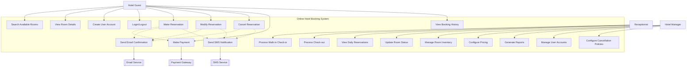

```mermaid

graph TD
    %% ========== ACTORS ==========
    Guest["Hotel Guest"]
    Receptionist["Receptionist"]
    Manager["Hotel Manager"]
    PaymentSystem[["Payment Gateway"]]
    SMSService[["SMS Service"]]
    EmailService[["Email Service"]]

    %% ========== SYSTEM BOUNDARY ==========
    subgraph "Online Hotel Booking System"
        %% ===== GUEST USE CASES =====
        uc1["Search Available Rooms"]
        uc2["View Room Details"]
        uc3["Create User Account"]
        uc4["Login/Logout"]
        uc5["Make Reservation"]
        uc6["Modify Reservation"]
        uc7["Cancel Reservation"]
        uc8["Make Payment"]
        uc9["View Booking History"]

        %% ===== RECEPTIONIST USE CASES =====
        uc10["Process Walk-in Check-in"]
        uc11["Process Check-out"]
        uc12["View Daily Reservations"]
        uc13["Update Room Status"]

        %% ===== MANAGER USE CASES =====
        uc14["Manage Room Inventory"]
        uc15["Configure Pricing"]
        uc16["Generate Reports"]
        uc17["Manage User Accounts"]
        uc18["Configure Cancellation Policies"]

        %% ===== NOTIFICATIONS =====
        uc19["Send Email Confirmation"]
        uc20["Send SMS Notification"]
    end

    %% ========== RELATIONSHIPS ==========
    %% Guest interactions
    Guest --> uc1
    Guest --> uc2
    Guest --> uc3
    Guest --> uc4
    Guest --> uc5
    Guest --> uc6
    Guest --> uc7
    Guest --> uc8
    Guest --> uc9

    %% Receptionist interactions
    Receptionist --> uc10
    Receptionist --> uc11
    Receptionist --> uc12
    Receptionist --> uc13

    %% Manager interactions
    Manager --> uc14
    Manager --> uc15
    Manager --> uc16
    Manager --> uc17
    Manager --> uc18

    %% External system interactions
    uc5 -.-> uc8
    uc8 --> PaymentSystem
    uc19 --> EmailService
    uc20 --> SMSService

    %% Notification triggers
    uc5 -.-> uc19
    uc5 -.-> uc20
    uc6 -.-> uc19
    uc6 -.-> uc20
    uc7 -.-> uc19
    uc7 -.-> uc20
    
```
